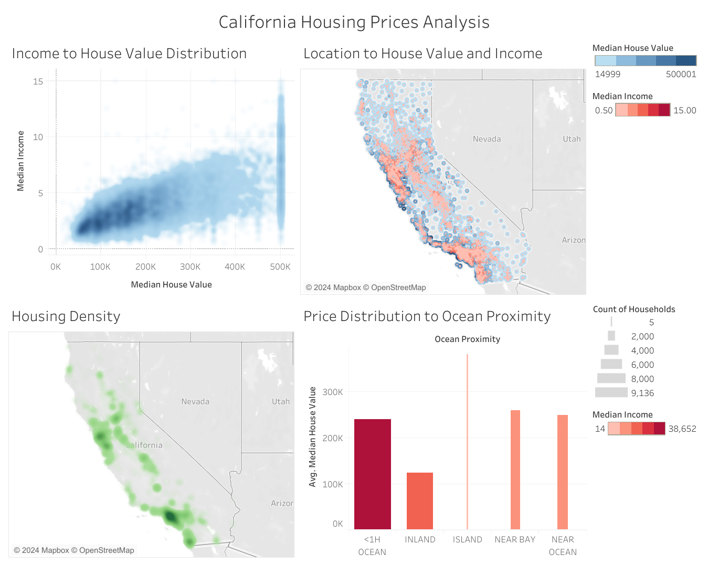

# California Housing Prices Analysis

## Overview
This repository contains an analysis of California housing prices using SQL and Tableau. The analysis explores patterns, trends, and correlations in the California Housing Prices Dataset to gain insights into the housing market dynamics.

## SQL Analysis
The SQL analysis involved querying the California Housing Prices Dataset to calculate correlations between various housing characteristics and median house values. Key findings from the SQL analysis include:
- Identification of correlations between median income, housing characteristics, and median house values.
- Spatial analysis to understand regional variations in housing prices across California.

## Tableau Visualizations
The Tableau visualizations provide a visual representation of the insights derived from the SQL analysis. Key visualizations include:
- Spatial distribution of housing prices across California.
- Income to house value distribution.
- Housing density across the state.
- Analysis of regional variations in housing prices across California.

## Contributors
- Turchanova Nataliia
